# 🔐 BioMark
### Biometric Attendance & Secure Authentication Android App

BioMark is a modern Android application built to provide **secure biometric authentication** and a **cloud-based attendance management system**.  
The project demonstrates real-world Android development practices with a strong focus on **security**, **Firebase integration**, and **clean UI flow**.

---

## 📌 Overview

Traditional attendance systems suffer from proxy attendance and weak authentication.  
BioMark addresses this problem by integrating **Android Biometric Authentication** with **Firebase Authentication**, ensuring that only verified users can log in and mark attendance. All attendance data is securely stored and synchronized in real time using Firebase.

---

## ✨ Features

- 🔑 Biometric authentication (Fingerprint / Device biometrics)
- 🔐 Firebase email & password authentication
- ☁️ Cloud-based attendance storage
- 📊 Admin & student panels
- 📍 Location & camera permission handling
- 🎨 Clean and structured UI flow
- 🛡 Security-first implementation

---

## 🛠 Tech Stack

- **Language:** Java  
- **Platform:** Android  
- **Authentication:** Firebase Authentication + Android Biometric API  
- **Database:** Firebase Realtime Database / Firestore  
- **IDE:** Android Studio  
- **Build Tool:** Gradle  

---

## 📱 Application Flow

1. Intro / Welcome Screens  
2. Login / Sign-up  
3. Biometric Authentication  
4. Student / Admin Dashboard  
5. Attendance Management  

---

## 📸 Screenshots

> Screenshots are stored in the `Screenshots/` directory.

```md
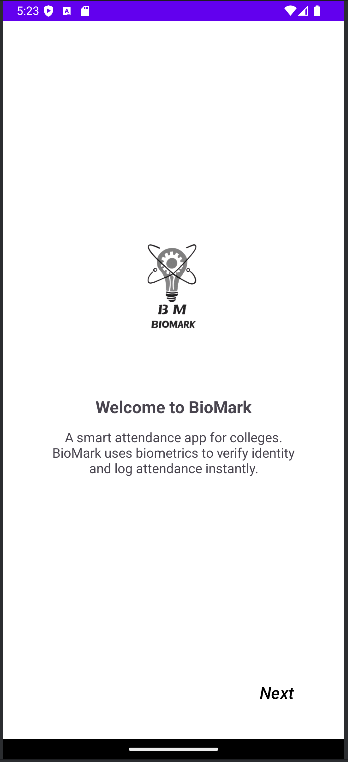
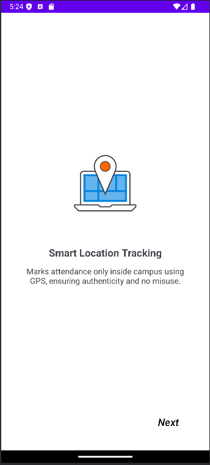
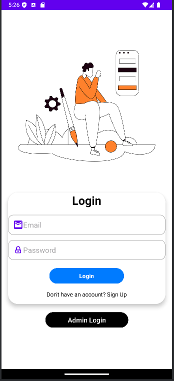
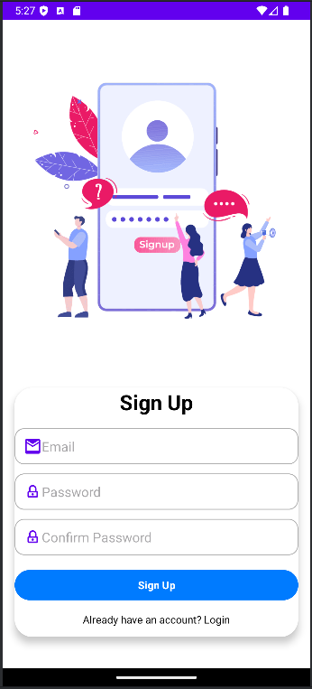
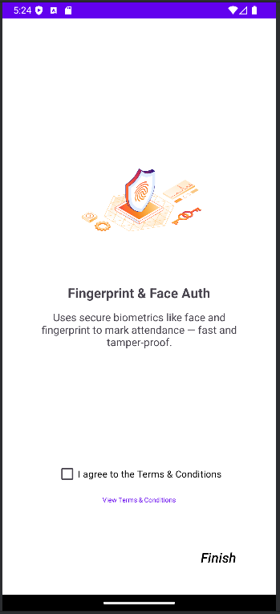
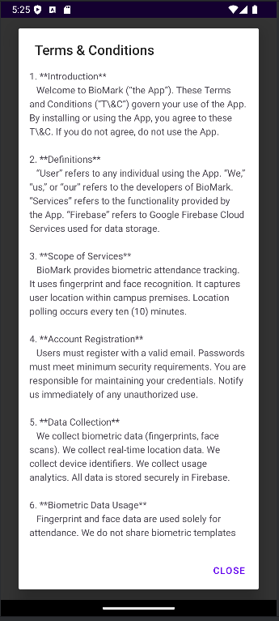
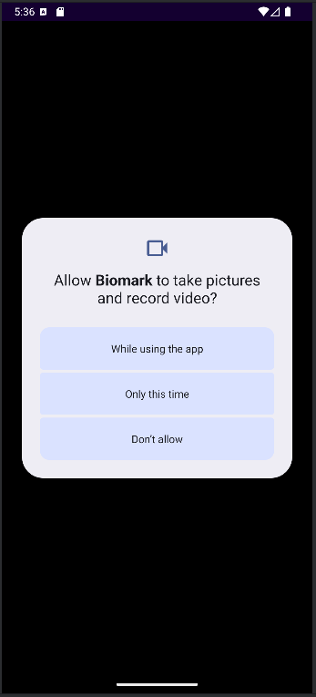
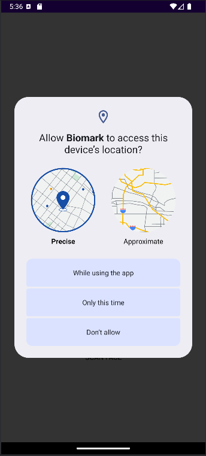
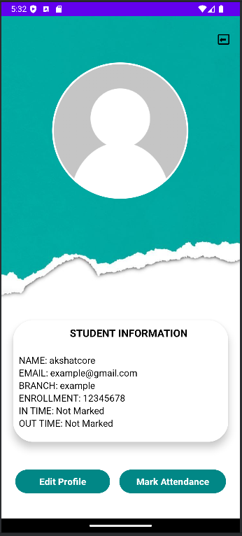
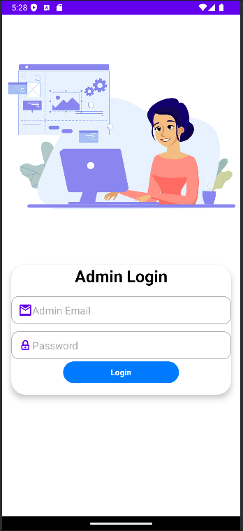
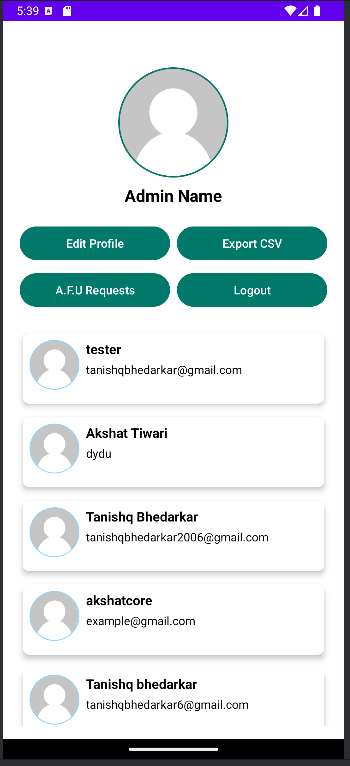
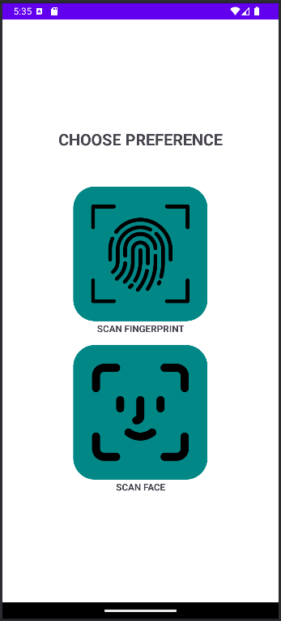
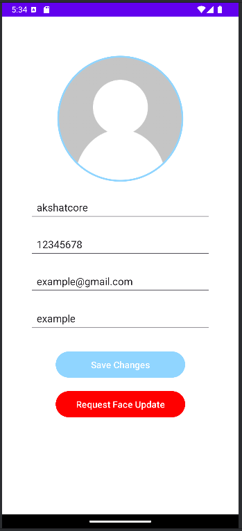
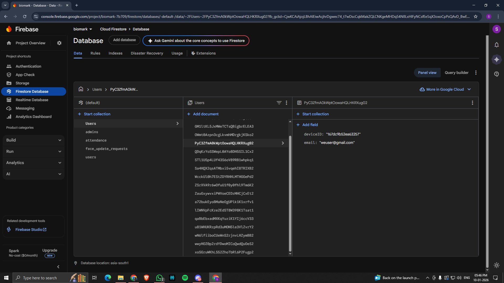
